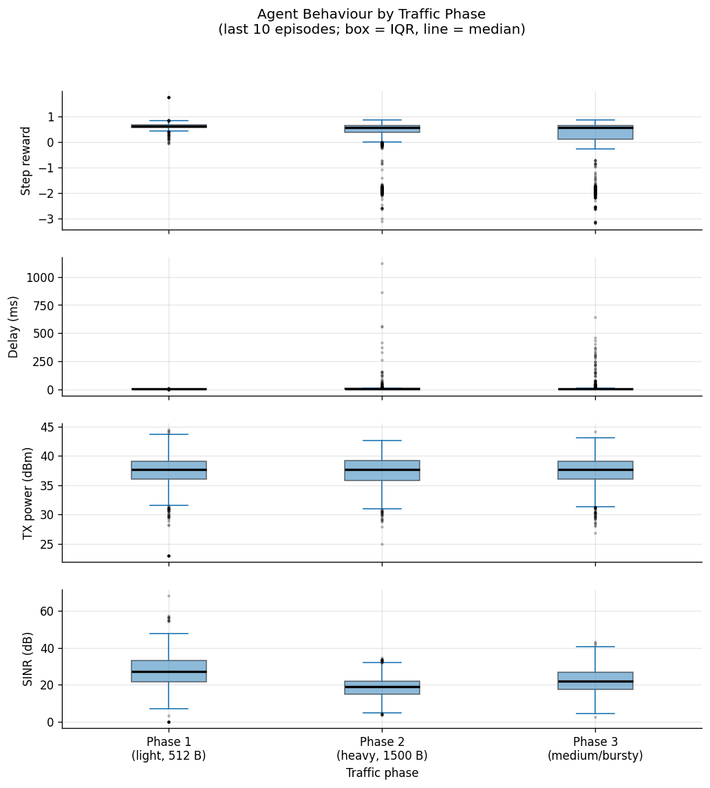
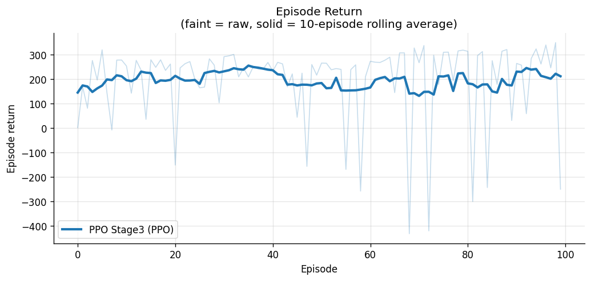
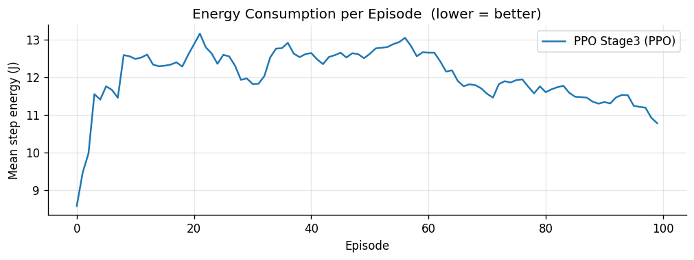

# Reinforcement Learning for 5G Base-Station Energy Efficiency

Can a reinforcement-learning agent cut a 5G base station's (gNodeB's) transmit power, and
so its energy use, without hurting the service users get? This project connects the
**Simu5G** network simulator to Python RL agents (**PPO** and **Double DQN**) over a
Gym-style interface, and trains them to set the gNodeB's transmit power as traffic
changes.

> My final-year dissertation project (**ECM3401**) at the University of Exeter (2026).



## How it works

```
┌─────────────────────────── OMNeT++ / Simu5G (C++) ──────────────────────────┐
│ gNodeB + UEs + traffic ──> GymConnection ──> observation, reward            │
│        ^                                              │                     │
│        └──── set TX power ◄── action ◄────────────────┤                     │
│                                                       │ ZMQ + Protobuf      │
└───────────────────────────────────────────────────────┼─────────────────────┘
                                                        v
                                   Python agent server (PyTorch PPO / DQN)
```

- **Simu5G-Gym** (`Simu5G-Gym/src/gym/`) is my C++ extension to Simu5G. It adds:
  - `GymConnection`, which exposes the simulation as an RL environment over ZMQ/Protobuf
    (veins-gym protocol)
  - `GymEnergyConsumer`, which models gNodeB energy use
- **Observation** (8 features): throughput, delay, jitter, packet loss, number of UEs,
  step energy (J), TX power (dBm) and SINR
- **Action:** a TX-power multiplier *m* ∈ [0, 2]. PPO picks it continuously. DQN picks it
  from 21 discrete bins.
- **Reward:** a tiered QoS score (delay, loss, jitter) minus an energy penalty. If QoS
  collapses, energy is ignored, so the agent can't save power by cutting users off.

## Training curriculum

Agents train in three stages, and each stage warm-starts from the one before:

| Stage | Scenario | Setting |
|---|---|---|
| 1 | `Train-Simple` | 1 UE, minor interference |
| 2 | `Train-Multi` | 2 UEs, moderate interference |
| 3 | `Train-Mobile` | 2 mobile UEs, full interference, variable traffic phases |

The agents are compared against fixed-power baselines (`server_fixed.py`). Training logs
are in `Simu5G-python/logs/`, checkpoints in `checkpoints/`, and plots for every stage and
agent in `Simu5G-python/plots/`.

| Episode return (PPO, stage 3) | Energy per episode (PPO, stage 3) |
|---|---|
|  |  |

## Repository layout

```text
.
├── Simu5G/            # Simu5G 5G library (vendored, LGPL-3.0)
├── Simu5G-Gym/        # My Gym bridge and energy model (C++), NED files, scenarios
│   ├── src/gym/
│   └── simulations/standalone/omnetpp.ini   # training and evaluation scenarios
├── Simu5G-python/     # Agent servers and analysis
│   ├── serverppo.py   # PPO (actor-critic, tanh-squashed Gaussian policy)
│   ├── serverdqn.py   # Double DQN with replay buffer
│   ├── server_fixed.py
│   ├── run.sh         # Launches simulator and agent together
│   └── plot_rollout.py
└── CMakeLists.txt     # Builds INET, Simu5G and Simu5G-Gym
```

OMNeT++ 6.3.0 and INET 4.5.4 aren't included. Install them into the repo root (see below).

## Setup

**Requirements:** Linux or WSL2, a C++17 compiler, CMake 3.16+, Python 3.10+, `protoc`,
and [`uv`](https://github.com/astral-sh/uv) (recommended).

1. Download [OMNeT++ 6.3.0](https://omnetpp.org/download/) and
   [INET 4.5.4](https://inet.omnetpp.org/Download.html), and extract both into the repo root
   as `omnetpp-6.3.0/` and `inet/`.
2. Build OMNeT++:
   ```bash
   cd omnetpp-6.3.0 && source setenv && ./configure && make -j$(nproc) && cd ..
   ```
3. Build INET, Simu5G and Simu5G-Gym:
   ```bash
   source omnetpp-6.3.0/setenv
   cmake -S . -B cmake-build-release -DCMAKE_BUILD_TYPE=Release
   cmake --build cmake-build-release --target all_release
   ```
4. Install the Python environment:
   ```bash
   cd Simu5G-python && uv sync
   ```

## Running

All commands run from `Simu5G-python/`. `./run.sh --help` lists every option, and
`./run.sh --list-scenarios` lists the scenarios.

```bash
# Train PPO on stage 1
./run.sh --agent ppo --mode train --episodes 100 --scenario Train-Simple \
  --checkpoint checkpoints/ppo_stage1.pt --log logs/ppo_stage1.csv

# Evaluate a trained policy
./run.sh --agent ppo --mode eval --episodes 10 --scenario Train-Mobile \
  --checkpoint checkpoints/ppo_stage3.pt --greedy

# Fixed-power baseline
./run_fixed_multi.sh --episodes 5

# Plot and compare runs
python3 plot_rollout.py --files logs/ppo_stage3.csv logs/dqn_stage3.csv --labels PPO DQN
```

`training.txt` lists the full set of commands used for the curriculum.

## Licence

Simu5G is LGPL-3.0 (see `Simu5G/LICENSE.md`). OMNeT++ is under the Academic Public
License, and INET is LGPL.
